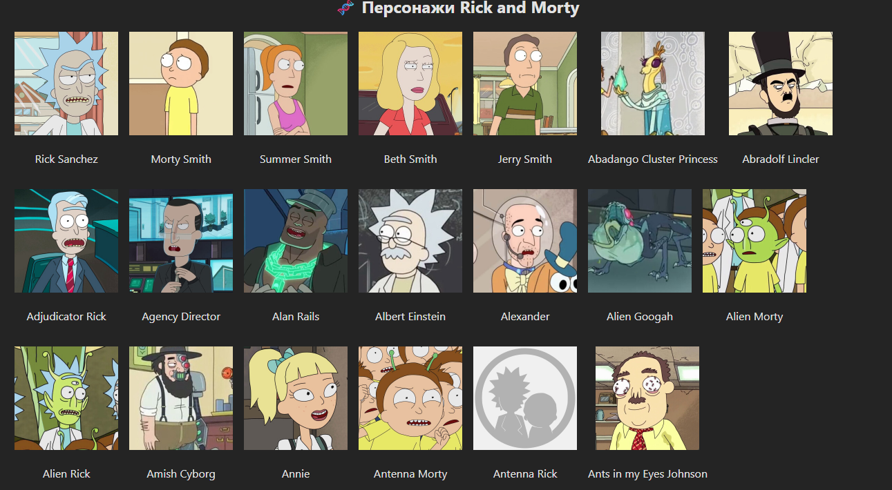

🧪 Rick and Morty Characters Viewer
Приложение на React + TypeScript, использующее Redux Toolkit и createAsyncThunk для асинхронной загрузки персонажей из Rick and Morty API.

🚀 Стек технологий
React

TypeScript

Redux Toolkit

Redux Thunk (createAsyncThunk)

Axios

Sass / CSS Modules

🎯 Функционал
Загрузка списка персонажей из API при монтировании компонента

Отображение статуса загрузки (loading)

Отображение ошибок, если они возникают при запросе

Вывод списка персонажей (имя и аватар)

📸 Скриншот

📦 Установка и запуск

# Клонируем репозиторий

git clone https://github.com/твоя-ссылка/rick-and-morty-viewer.git
cd rick-and-morty-viewer

# Устанавливаем зависимости

npm install

# Запускаем проект

npm run dev
